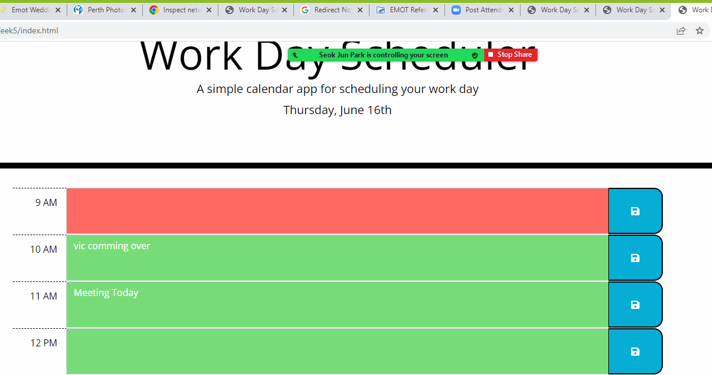

# Day scheduler

If you are using the scheduler you can set your appointments by adding information to the time lot you have available.  

## Features

You will see that the available time is in green, this is were you can add your personal  to do information and then hit the save button.

1. You can start adding apointments by clicking the green boxes with the required times and press save.  

    

## Author

- **Vittorio Natoli**
    - Email: vittorio@emot.com.au
